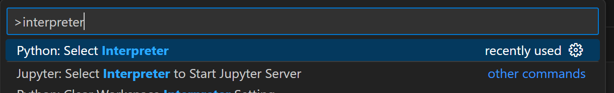
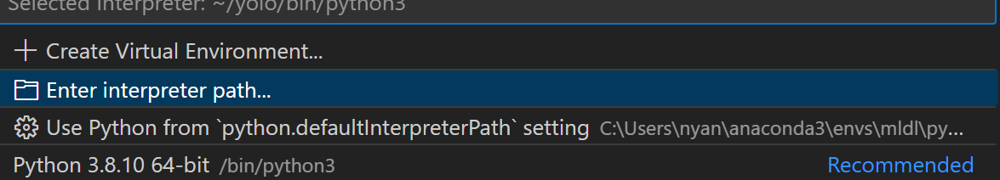

# YOLOv8_for_ROS2
ROS2 강의에서 YOLOv8 사물인식 파트에 대한 강의 자료


# Ubuntu 20.04, 22.04 초기 설정 및 YOLOv8 환경 구축

## 처음 우분투 세팅

```bash
sudo apt update
sudo apt upgrade
sudo apt install python3-pip
sudo apt install python3.8-venv
```

## 가상환경 만들고 실행하기

```bash
python3.8 -m venv yolo
source yolo/bin/activate
```

## YOLOv8 패키지 설치하기

```bash
pip3 install ultralytics
```

## 내 PC에서 GPU를 사용하여 YOLO를 돌릴 수 있는지 확인하기

1. 가상환경 활성화

    ```bash
    source yolo/bin/activate
    ```

2. 파이썬 인터프리터 실행

    ```bash
    python3
    ```

3. GPU 사용 가능 여부 확인

    ```python
    import torch
    torch.cuda.is_available()
    ```

    - 만약 `True`가 출력되면 GPU가 잡힌 것입니다.
    - `False`가 출력되면 CPU를 사용하게 됩니다.

    무거운 모델을 구동할 것이 아니라면 크게 상관 없습니다.

## 강의 자료 코드 로컬에 불러오기

1. 우분투 터미널 실행

    ```bash
    mkdir YOLOv8_ROS2
    cd YOLOv8_ROS2
    git clone https://github.com/Nyan-SouthKorea/YOLOv8_for_ROS2.git
    ```
    clone된 해당 폴더로 이동

3. VS코드 실행(방금 위에서 생성한 yolo 가상환경 연결하기)

1. Ctrl + Shift + p 버튼을 누르고 "interpreter" 라고 검색하면 아래의 버튼으로 유도됨


2. Enter interpreter path 선택


3. Find -> .. -> yolo -> bin -> python3 선택

4. VS코드 종료 후 재 실행

5. 아무 코드나 실행해보자. 이 때 select interpreter에서 yolo가 보이면 선택

6. 이후 VS코드 관련 extension을 설치하라는 안내가 나오면 모두 설치해준다. 그리고 실행이 안되면 VS코드 재실행 반복

7. 우리가 만든 yolo라는 가상환경으로 코드를 돌릴 수 있도록 설정 마침